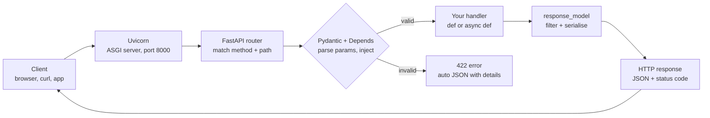

# Python Project Setup & Running Code — Interview Guide

Oct 5, 2026 · Krishnendu Ghosal · [Live doc](https://claude.ai/code/artifact/46f8afb4-ddcb-4eb5-bab7-0eaab3d7f3a8)

## Contents
https://claude.ai/artifact/9mJcFeVzZVCJBb2yMzBtwZ?sk=VsLXZXoNQeKdNqQjm_N4iA#74e8481b-885e.mhyc94xvbzw.1757
1. [Overview](#overview)
2. [Python environments](#python-environments)
3. [Ways to run Python code](#ways-to-run-python-code)
4. [Setting up a FastAPI project](#setting-up-a-fastapi-project)
5. [Project structure and best practices](#project-structure-and-best-practices)
6. [Interview questions](#interview-questions)
7. [Cheat sheet](#cheat-sheet)

## Overview

For any Python project: create an isolated environment, declare dependencies in `pyproject.toml`, lock them, and run code through that environment. For an API, add FastAPI and serve it with Uvicorn. This guide covers each step with the commands, then lists interview questions on the same topics.

- **Sections 2–3**: environments and the different ways to run Python code. These apply to every project, including the DSA practice repo.
- **Sections 4–5**: building a FastAPI project from scratch and organising it like a production repo.
- **Section 6**: interview questions with short answers you can say out loud.
- **Section 7**: a command cheat sheet to revise before the interview.

## Python environments

A virtual environment is a folder with its own Python interpreter and `site-packages`. Each project then has its own package versions and doesn't break the others or the system Python.

| Tool | What it does | Lock file | When to use |
| --- | --- | --- | --- |
| `venv` + `pip` | Built-in env + installer | None (`requirements.txt` by hand) | Quick scripts, no extra install |
| Poetry | Env + deps + lock + packaging | `poetry.lock` | Apps and libraries, team projects |
| uv | Very fast pip/venv/project manager (Rust) | `uv.lock` | Same jobs as Poetry, much faster installs |
| conda | Env + non-Python packages (CUDA, C libs) | `environment.yml` | Data science / ML stacks |
| pyenv | Installs several Python *versions* | — | Switching 3.11 / 3.12 / 3.13 |

### Plain venv (good to know for interviews)

```bash
python3 -m venv .venv          # create
source .venv/bin/activate      # activate (Windows: .venv\Scripts\activate)
pip install requests           # install into the env
pip freeze > requirements.txt  # snapshot versions
pip install -r requirements.txt
deactivate
```

### Poetry

```bash
poetry new my-app              # new project with src layout
poetry init                    # or add pyproject.toml to an existing folder
poetry config virtualenvs.in-project true   # put .venv inside the project
poetry add fastapi             # runtime dependency
poetry add --group dev pytest  # dev-only dependency
poetry install                 # create env + install from poetry.lock
poetry env info                # which interpreter is used
```

### Key files

- **`pyproject.toml`**: the standard project file (PEP 518/621). It holds the name, Python version, dependencies and tool settings (pytest, ruff, mypy).
- **`poetry.lock`**: exact resolved versions of every package, including indirect ones. Commit it so every machine installs the same versions.
- **`.venv/`**: the environment itself. Never commit it; recreate it with `poetry install`.

**In-project `.venv` vs central cache:** keeping it in the project means IDEs find it automatically, and deleting the folder resets it. A central cache keeps project folders small. Most teams use in-project.

## Ways to run Python code

Always run code through the project's environment, using `poetry run` or an activated `.venv`. Otherwise the system Python runs your code and can't see the packages you installed.

| Way | Command | Use it for |
| --- | --- | --- |
| Run a file | `python dsa/01_arrays/001_two_sum.py` | Quick check of one script |
| Run a module | `python -m app.main` | Code that imports sibling packages; resolves imports from the project root |
| Through Poetry | `poetry run python file.py` | No need to activate the env |
| Activated env | `source .venv/bin/activate` then `python file.py` | Many commands in one terminal |
| REPL | `python` or `poetry run ipython` | Trying out snippets |
| One-liner | `python -c "print(sum(range(10)))"` | Tiny checks in a shell |
| Tests | `poetry run pytest -k two_sum -v` | Verifying solutions |
| Executable script | `chmod +x run.py` and `./run.py` | CLI tools (needs a shebang) |
| Web server | `uvicorn app.main:app --reload` | FastAPI apps |

### The `__main__` guard

```python
def main():
    print("running")

if __name__ == "__main__":   # True only when run directly
    main()                   # skipped when another file imports this one
```

When you run a file, Python sets `__name__` to `"__main__"`. When the file is imported, `__name__` is the module's name. The guard lets one file work both as a script and as an importable module.

### Shebang for executable scripts

```python
#!/usr/bin/env python3
print("hello")
```

### `python file.py` vs `python -m package.module`

- `python file.py` puts the **file's folder** on `sys.path`. Imports from parent folders then fail with `ModuleNotFoundError`.
- `python -m pkg.mod` puts the **current directory** on `sys.path` and runs the module as part of its package. Relative imports (`from .utils import x`) work. Prefer it inside real projects.

## Setting up a FastAPI project

The full process is 6 steps: create the project with Poetry, add `fastapi[standard]`, write an `app` object, add routes and Pydantic models, run it with `fastapi dev` or Uvicorn, then open `/docs`.



If input fails validation, FastAPI returns a 422 and your handler never runs. On success, `response_model` decides which fields go back to the client.

### 1. Create the project

```bash
mkdir todo-api && cd todo-api
poetry init -n --python ">=3.12"
poetry config virtualenvs.in-project true --local
poetry add "fastapi[standard]"       # fastapi + uvicorn + pydantic + httpx + CLI
poetry add --group dev pytest ruff
mkdir -p app/routers tests && touch app/__init__.py app/routers/__init__.py
```

### 2. Smallest working app: `app/main.py`

```python
from fastapi import FastAPI

app = FastAPI(title="Todo API")

@app.get("/health")
def health() -> dict:
    return {"status": "ok"}
```

### 3. Run it

```bash
poetry run fastapi dev app/main.py                # dev mode, auto-reload
poetry run uvicorn app.main:app --reload          # same thing, with Uvicorn directly
poetry run uvicorn app.main:app --host 0.0.0.0 --port 8000 --workers 4   # production-style
```

In `app.main:app`, the part before the colon is the module path (`app/main.py`). The part after it is the variable name of the FastAPI instance.

### 4. Open the auto-generated docs

- `http://127.0.0.1:8000/docs`: Swagger UI, where you can try every endpoint.
- `http://127.0.0.1:8000/redoc`: ReDoc view.
- `http://127.0.0.1:8000/openapi.json`: the raw OpenAPI schema.

### 5. Models, path/query params and a router: `app/routers/todos.py`

```python
from fastapi import APIRouter, HTTPException, status
from pydantic import BaseModel, Field

router = APIRouter(prefix="/todos", tags=["todos"])

class TodoIn(BaseModel):
    title: str = Field(min_length=1, max_length=100)
    done: bool = False

class TodoOut(TodoIn):
    id: int

_db: dict[int, TodoOut] = {}

@router.get("/", response_model=list[TodoOut])
def list_todos(done: bool | None = None):          # query param: /todos?done=true
    items = list(_db.values())
    return [t for t in items if done is None or t.done == done]

@router.get("/{todo_id}", response_model=TodoOut)
def get_todo(todo_id: int):                         # path param, auto-validated as int
    if todo_id not in _db:
        raise HTTPException(status_code=404, detail="Todo not found")
    return _db[todo_id]

@router.post("/", response_model=TodoOut, status_code=status.HTTP_201_CREATED)
def create_todo(body: TodoIn):                       # JSON body, validated by Pydantic
    todo = TodoOut(id=len(_db) + 1, **body.model_dump())
    _db[todo.id] = todo
    return todo
```

Register it in `main.py`:

```python
from app.routers import todos
app.include_router(todos.router)
```

### 6. Dependencies (dependency injection)

```python
from typing import Annotated
from fastapi import Depends, Header, HTTPException

def get_current_user(x_token: Annotated[str, Header()]) -> str:
    if x_token != "secret":
        raise HTTPException(status_code=401, detail="Invalid token")
    return "krish"

@router.get("/me")
def me(user: Annotated[str, Depends(get_current_user)]):
    return {"user": user}
```

`Depends` is how FastAPI shares logic across routes: DB sessions, auth, settings and pagination. You can swap a dependency in tests with `app.dependency_overrides`.

### 7. Async endpoints

```python
import httpx

@app.get("/joke")
async def joke():
    async with httpx.AsyncClient() as client:
        r = await client.get("https://official-joke-api.appspot.com/random_joke")
    return r.json()
```

Use `async def` when the handler `await`s async I/O (httpx, asyncpg, motor). Use plain `def` for blocking code: FastAPI runs those in a thread pool so they don't block the event loop.

## Project structure and best practices

Split the app by responsibility. Routes handle HTTP, schemas validate data, services hold business logic, and a `core` module holds config. Keep secrets out of code and test through `TestClient`.

```
todo-api/
├── app/
│   ├── __init__.py
│   ├── main.py            # creates FastAPI(), includes routers
│   ├── core/config.py     # settings from env vars
│   ├── routers/todos.py   # HTTP layer only
│   ├── schemas/todo.py    # Pydantic request/response models
│   ├── services/todo.py   # business logic, no FastAPI imports
│   ├── models/            # DB tables (SQLAlchemy / SQLModel)
│   └── db.py              # engine + session dependency
├── tests/test_todos.py
├── .env                   # local secrets, git-ignored
├── .env.example           # committed, shows required keys
├── Dockerfile
├── pyproject.toml
└── poetry.lock
```

### Config from environment variables

```bash
poetry add pydantic-settings
```

```python
# app/core/config.py
from pydantic_settings import BaseSettings, SettingsConfigDict

class Settings(BaseSettings):
    app_name: str = "Todo API"
    database_url: str = "sqlite:///./dev.db"
    debug: bool = False
    model_config = SettingsConfigDict(env_file=".env")

settings = Settings()
```

### Testing with `TestClient`

```python
# tests/test_todos.py
from fastapi.testclient import TestClient
from app.main import app

client = TestClient(app)

def test_create_and_get():
    r = client.post("/todos/", json={"title": "learn fastapi"})
    assert r.status_code == 201
    todo_id = r.json()["id"]
    assert client.get(f"/todos/{todo_id}").json()["title"] == "learn fastapi"

def test_validation_error():
    assert client.post("/todos/", json={"title": ""}).status_code == 422
```

Run the tests with `poetry run pytest -v`.

### `.gitignore` essentials

`.venv/`, `__pycache__/`, `*.pyc`, `.pytest_cache/`, `.env`, `*.db`, `dist/`, `.DS_Store`.

### Docker basics

```dockerfile
FROM python:3.13-slim
WORKDIR /code
RUN pip install --no-cache-dir poetry && poetry config virtualenvs.create false
COPY pyproject.toml poetry.lock ./
RUN poetry install --no-root --only main
COPY app ./app
CMD ["uvicorn", "app.main:app", "--host", "0.0.0.0", "--port", "8000"]
```

```bash
docker build -t todo-api . && docker run -p 8000:8000 --env-file .env todo-api
```

The dependency files are copied before the app code so Docker caches the install layer. Changing only your code then rebuilds in seconds.

## Interview questions

Each answer is short enough to say in 20–30 seconds. Expect a follow-up asking for an example, so keep one ready for each.

### Environments and packaging

1. **Why use a virtual environment?**
   - It isolates each project's dependencies so different version needs don't conflict. It also keeps the system Python clean and makes setups reproducible.
2. **`requirements.txt` vs `pyproject.toml` + lock file?**
   - `requirements.txt` is just a list of packages. `pyproject.toml` is the standard project file for metadata, deps and tool config. The lock file pins every indirect dependency to an exact version and hash.
3. **Why commit `poetry.lock`?**
   - So CI, teammates and production all install exactly the same versions. Without it, you get "works on my machine" bugs.
4. **Caret `^1.2.3` in Poetry means?**
   - `>=1.2.3,<2.0.0`. Minor and patch updates are allowed; breaking major updates are not.
5. **What is `sys.path` and why do I get `ModuleNotFoundError`?**
   - `sys.path` is the list of folders Python searches when importing. The error usually means the wrong interpreter (env not active) or a script run from the wrong directory. Fix it with `poetry run` or `python -m pkg.mod`.
6. **What does `if __name__ == "__main__"` do?**
   - The block runs only when the file is executed directly, not when it is imported.
7. **What is `__init__.py` for?**
   - It marks a folder as a regular package, can run package setup code and controls what is exposed. Since Python 3.3, folders without it still work as namespace packages.

### FastAPI

1. **Why FastAPI over Flask or Django?**
   - It's async-native (ASGI), validates requests from type hints via Pydantic, and generates OpenAPI docs automatically. It's also very fast. Flask is simpler but synchronous with no validation built in. Django is batteries-included with an ORM and admin panel.
2. **WSGI vs ASGI?**
   - WSGI is the synchronous interface: one request per worker thread (Flask, classic Django). ASGI is asynchronous and supports `async`/`await`, WebSockets and long-lived connections (FastAPI, Starlette).
3. **What is Uvicorn?**
   - An ASGI server. It accepts HTTP connections and calls your FastAPI app. FastAPI itself is only the framework.
4. **`def` vs `async def` endpoints?**
   - `async def` runs on the event loop, so only `await` non-blocking I/O inside it. Plain `def` runs in a thread pool. Calling blocking code like `time.sleep` or `requests` inside `async def` freezes every request.
5. **What does Pydantic do here?**
   - It parses and validates request bodies, query and path params into typed objects. It also serialises responses through `response_model`. Invalid input gets an automatic 422 response.
6. **What is dependency injection in FastAPI?**
   - `Depends(fn)` lets FastAPI call `fn` and pass the result into your handler. It's used for DB sessions, auth and config, and can be overridden in tests.
7. **Path vs query vs body params?**
   - Names in the URL template (`/items/{id}`) are path params. Other simple-typed args are query params (`?q=x`). Pydantic model args are read from the JSON body.
8. **How do you return a 404?**
   - `raise HTTPException(status_code=404, detail="...")`.
9. **Middleware vs dependency?**
   - Middleware wraps every request (CORS, logging, timing). A dependency runs only for the routes that declare it and can return values.
10. **How do you scale a FastAPI app?**
    - Run multiple Uvicorn workers (`--workers N`, or Gunicorn with Uvicorn workers) behind a load balancer. Keep the app stateless, with state in a DB or Redis. Use async I/O drivers.

### Python basics they mix in

1. **List vs tuple?** A list is mutable; a tuple is immutable and hashable, so it can be a dict key.
2. **What is the GIL?** A lock in CPython that lets only one thread run Python bytecode at a time. Threads still help for I/O-bound work; use `multiprocessing` for CPU-bound work. Python 3.13 also has an optional free-threaded build.
3. **Generator vs list?** A generator produces values lazily with `yield` and uses O(1) memory. A list builds every item up front.
4. **Decorators?** A function that takes a function and returns a wrapped one. `@app.get(...)` is a decorator that registers a route.
5. **`is` vs `==`?** `is` checks whether two names point to the same object; `==` checks whether the values are equal.

## Cheat sheet

| Task | Command |
| --- | --- |
| Install Poetry | `uv tool install poetry` or `curl -sSL https://install.python-poetry.org \| python3 -` |
| New project in current folder | `poetry init` |
| Env inside project | `poetry config virtualenvs.in-project true --local` |
| Install everything | `poetry install` |
| Add / remove a package | `poetry add httpx` / `poetry remove httpx` |
| Add a dev tool | `poetry add --group dev pytest` |
| Update locked versions | `poetry update` |
| Show dependency tree | `poetry show --tree` |
| Activate env | `source .venv/bin/activate` or `eval $(poetry env activate)` |
| Run a file | `poetry run python path/to/file.py` |
| Run as module | `poetry run python -m app.main` |
| Run tests | `poetry run pytest -v` / `-k name` / `path/to/file.py` |
| Lint + format | `poetry run ruff check . --fix` and `poetry run ruff format .` |
| FastAPI dev server | `poetry run fastapi dev app/main.py` |
| FastAPI with Uvicorn | `poetry run uvicorn app.main:app --reload` |
| API docs | `http://127.0.0.1:8000/docs` |
| Plain venv | `python3 -m venv .venv && source .venv/bin/activate` |
| Freeze for pip users | `pip freeze > requirements.txt` |
| Reset the env | `rm -rf .venv && poetry install` |
